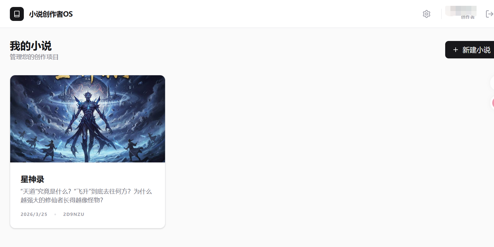

<div align="center">
  <h1>📖 小说创作者 OS (Novel Creator OS)</h1>
  <p>您的下一代 AI 驱动小说创作工作站 | Your Next-Gen AI-Powered Novel Writing Workspace</p>

  <p align="center">
    <a href="https://reactjs.org/"></a>
    <a href="https://tailwindcss.com/"></a>
    <a href="https://vitejs.dev/"></a>
    <a href="#"></a>
    <a href="#"></a>
  </p>
</div>

---

**小说创作者 OS** 是一款专为现代网络小说作者、编剧和创意写作者打造的智能化写作平台。通过深度集成 AI 大模型能力，它不仅提供了一个纯粹的写作环境，更是您构建宏大世界观、推演剧情、审核章节的得力助手。

## ✨ 核心特性 (Features)

*   🤖 **AI 深度赋能**: 支持 AI 辅助写作、章节质量审核、根据反馈一键重写。
*   📚 **结构化世界观构建**: 独立的「大纲」、「背景内容库」、「人物库」、「任务线」和「物品库」管理，让长篇创作不再混乱。
*   🎛️ **高度自由的沉浸式工作区**: 采用可自由拖拽的面板设计（Resizable Panels），无论您是在大屏还是小屏上，都能找到最舒适的写作姿势。
*   🌍 **多语言与平台定制**: 原生支持中英双语切换，并可针对特定发布平台（如起点、番茄等）进行 AI 风格定制。
*   📊 **透明的 Token 管理**: 内置 Token 消耗量统计，让您的 AI 使用成本一目了然。

## 📸 界面预览 (Screenshots)

### 1. 项目管理台 (Dashboard)
清晰直观的项目管理界面，轻松管理您的所有创作项目。


### 2. 沉浸式创作工作区 (Workspace)
集成了章节管理、核心编辑器与多维度设定库的强大工作区。支持面板自由拖拽缩放，内容自适应显示。


### 3. 全局配置与 AI 设置 (Configuration)
灵活的全局设置，支持自定义 AI 写作提示词（Prompt）、模型选择以及语言切换。


## 🚀 快速开始 (Getting Started)

### 环境要求
*   Node.js >= 18.0.0
*   npm 或 yarn

### 安装与运行

1. **克隆项目**
   ```bash
   git clone https://github.com/yourusername/novel-creator-os.git
   cd novel-creator-os
   ```

2. **安装依赖**
   ```bash
   npm install
   ```

3. **配置环境变量**
   复制 `.env.example` 文件并重命名为 `.env`，填入您的 API Key 等信息：
   ```bash
   cp .env.example .env
   ```

4. **启动开发服务器**
   ```bash
   npm run dev
   ```

## 🛠️ 技术栈 (Tech Stack)

*   **前端框架**: React 18 + TypeScript
*   **构建工具**: Vite
*   **样式方案**: Tailwind CSS + shadcn/ui
*   **布局交互**: react-resizable-panels (支持自由拖拽的面板布局)
*   **图标库**: Lucide React
*   **后端/数据库**: Firebase (Firestore)
*   **AI 接口**: Google Gemini API (或其他兼容的 LLM)

## 🤝 参与贡献 (Contributing)

欢迎提交 Pull Request 或 Issue！如果您有任何关于小说创作的新想法，也欢迎在 Discussions 中与我们探讨。

## 📄 开源协议 (License)

本项目采用 [MIT License](LICENSE) 开源协议。
